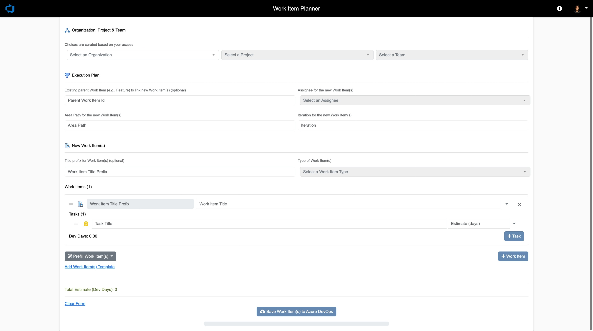

# Work Item Planner

Work Item Planner is a web application that allows users to generate Work Items that encompass all the action items while working on a feature.



## Getting Started

### Hosted Version

The application is hosted using Azure App Service (Web App).

- Azure App Service Web App: [WorkItemPlanner](https://ms.portal.azure.com/#@microsoft.onmicrosoft.com/resource/subscriptions/87462284-7600-4279-afa5-6ada5a13fdae/resourceGroups/rg-WorkItemPlanner/providers/Microsoft.Web/sites/WorkItemPlanner/appServices)
- Subscription Name: 
- Subscription ID: 
- Tenant: Corp

Application URL: https://workitemplanner.codeapp.ms/
Vanity URL: https://aka.ms/workitemplanner, https://aka.ms/featureplanner, https://aka.ms/scenarioplanner

### Deployment

#### Manual Deployment

1. Ensure to run the `npm install` locally before building using this approach.
1. Install the [App Service extension](https://marketplace.visualstudio.com/items?itemName=ms-azuretools.vscode-azureappservice) for Visual Studio Code.
1. In the App Service explorer, select the mentioned App Service, right click on it and click deploy.

Refer to [this](https://learn.microsoft.com/en-us/azure/app-service/quickstart-nodejs?tabs=windows&pivots=development-environment-vscode#configure-the-app-service-app-and-deploy-code) document for the detailed deployment steps. Ignore the steps which create the App Service itself.

#### Automated Deployment

A pipeline [Tools.WorkItemPlanner-deploy](https://dev.azure.com/mseng/AzureDevOps/_build?definitionId=19224&_a=summary) has been created to build and deploy. Once a PR is merged to the 'main' branch the code is automatically deployed.

[](https://dev.azure.com/mseng/AzureDevOps/_build/latest?definitionId=19224&branchName=master)

### Running Locally

To run the application locally, you'll need to have Node.js and npm (Node Package Manager) installed on your machine. Here's how to set it up:

1. Clone the repository: `git clone https://github.com/microsoft/Tools.WorkItemPlanner.git`
1. Install the dependencies by running: `npm install`
1. Start the local development server: `npm start`
1. Open your web browser and visit: `http://localhost:3000`
1. Note that you may have to enable CORS on your browser when running locally. There are a good number of Edge plugins to help you with this.

## Usage

1. Fill out the required fields in the form, providing Organization, Project, Feature Id, Area Path, Iteration & Work Item(s).
1. Click the "Prefill Work Item(s)" button to create the ADO items under the mentioned Feature.
1. To add more Work Item(s), click the "+ Work Item" button.
1. To add tasks to a Work Item(s), click the "+ Task" button under the specific Feature/Scenario.
1. To reset the form, click the "Reset Form" link.
1. To prefill the form with the Work Item(s) from a template, click on "Prefill Work Item(s)".

## Updating Configuration

### Adding/Updating Organization/Project/Team/Area-Path/Iteration choices

Dropdowns are populated based on the user's access to Organizations, Projects, Teams, Area Paths & Iterations in Azure DevOps.

### Onboarding a Work Item template

Teams have the choice to onboard their own template i.e., customized choice of Work Item(s). To onboard a new template follow these steps.

1. Create a JSON file adhering to this schema. Here is a reference template [wpx_engineering_dcr_v1.0.0.json](https://github.com/microsoft/Tools.WorkItemPlanner.git?path=/public/work_item_templates/w%2Bd_engineering_dcr_v1.0.0.json);

```javascript
{
  "version": "1.0.0",
  "template": {
    "workitems": [
      {
        "title": "string",
        "tasks": [
          {
            "title": "string",
            "estimate": "number"
          }
        ]
      }
    ]
  }
}
```

2. Ensure to name the template in strict adherence to the following pattern - teamname_category_release_version.

|  | |
| -------- | ------- |
| 'teamname'  | your team name |
| 'category' | 'engineering' or 'design' or 'product' |
| 'release' | 'moments' or 'dcr' |
| 'version' | numeric version with the letter 'v' as prefix |

` File name cannot contain any special characters other than underscore(_) or whitespace( ) `

Example: wpx_engineering_dcr_v1.json, wpx_product_moments_v1.json

3. Clone the repository: `git clone https://github.com/microsoft/Tools.WorkItemPlanner.git` and create a local branch.

4. Save the template at the this location '\Tools.WorkItemPlanner\public\work_item_templates'.

5. Add the template file name and the display name to the 'work_item_templates_index.js' file located in '\tools.WorkItemPlanner\public\work_item_templates'. Ensure adherence to the existing naming convention in the file.

6. Raise a pull request to the 'main' branch with the above additions.

71. Once your pull request is approved and completed, the new template is automatically deployed within 10 minutes.

## Infra - One Time Step

Below are the niche steps which were executed to get the application up and running.

### Custom entry to web.config

If you upload a .json file to the Windows Azure website and try to access it, it would give you a 404 File Not Found error, because the MIME Type of .json is not set by default. This also applies in general to any file that might need a specific MIME Type. To fix this issue, edit the web.config file located in the root directory of the application.

```xml
<!-- Mime type mapping -->
    <staticContent>
        <remove fileExtension=".json" />
        <mimeMap fileExtension=".json" mimeType="application/json" />
        <mimeMap fileExtension=".webp" mimeType="image/webp" />
    </staticContent>
```

> The effective web.config for any Azure App Service app can be accessed via the 'Kudu' service - https://workitemplanner.scm.azurewebsites.net/DebugConsole

### Azure Application Insights Configuration

1. Application Insights has been enabled to monitor both client-side and server-side telemetry. While separate Application Insights resources are recommended for the client and server, a single instance is being used since this is an internal tool. The configuration status of this instance can be accessed via this endpoint - https://workitemplanner.scm.azurewebsites.net/ApplicationInsights

1. Azure Application Insights Connection String is provided as an environment variable `APPLICATIONINSIGHTS_CONNECTION_STRING`.

## Contributing

Contributions are welcome! If you find any bugs or have suggestions for improvements, please submit a pull request or reach out to <adityamankal@microsoft.com>.

## Future plan

- Implement SSO with User Identity (or) Service Principal - COMPLETED
- Support for custom templates - COMPLETED
- Telemetry - COMPLETED

## SDL Assessment

[August_2023 - Scenario Planner](https://microsoft.visualstudio.com/OS/_compliance/product/5dafcc76-b9d2-95a7-70e9-6d13bf17075d/assessments/31880c02-6108-fcb1-5c5e-5cefc0d355de)